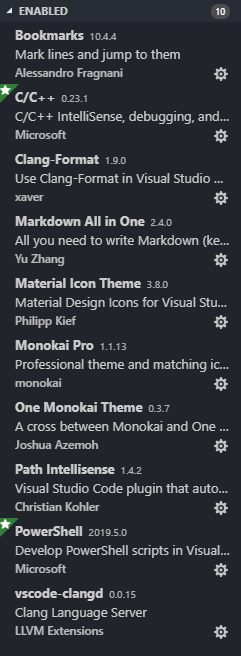

# Markdown
## Syntax
---
 - Table 參考寫法: (需要注意table前要加至少兩個空白字元+newline, 否則會顯示不出來)
  
| Age          | Time  | Food | Gold | Requirement             |
| ------------ | :---: | ---: | ---: | ----------------------- |
| Feudal Age   | 02:10 |  500 |    0 | Dark Age building x 2   |
| Castle Age   | 02:40 |  800 |  200 | Feudal Age building x 2 |
| Imperial Age | 03:30 | 1000 |  800 | Castle Age building x 2 |

 - vscode的Markdown參考Github Flavored Markdown (GFM), 有用列表如下:  
   - 調整目前table syntax成為GFM: <kbd>SHIFT</kbd> + <kbd>ALT</kbd> + <kbd>F</kbd>  
   - 打出特殊鍵: <kbd>CTRL</kbd>  
  
 - 利用mermaid語法在code block裡面定義流程圖
  mermaid是一個流程下面是流程圖的非正規markdown語法
  ```mermaid
  graph LR
    A --> B 
  ```
  
參考來源:  
 1. [Markdown 表格語法原則](https://blog.fntsr.tw/articles/2017/02/07/principle-of-markdown-table-syntax/)

## Troubleshooting
---
 - vscode的preview無法顯示checkbox, 要安裝[Markdown All in One](https://marketplace.visualstudio.com/items?itemName=yzhang.markdown-all-in-one)才會有.  
   p.s. 目前安裝的vscode extension如下:  
   
 - 插入圖片並顯示:
    
 - 
