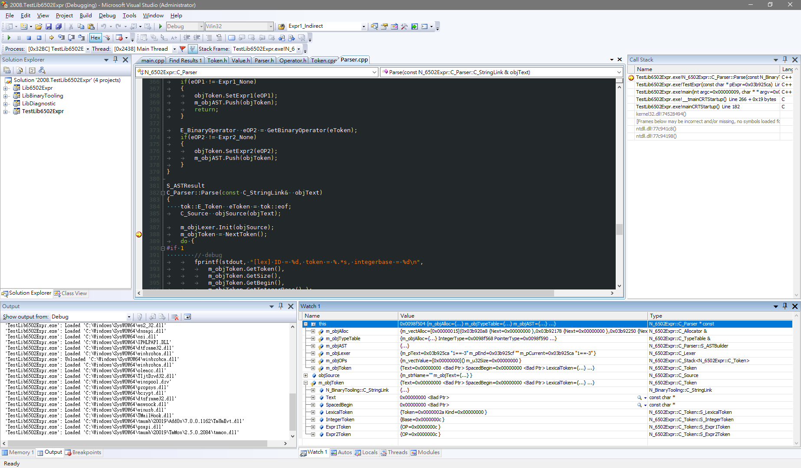

# Watch Window 工作紀錄

``C_6502CVariableInfoReader::ReadVariableInfo``負責處理expression, 並取得計算後的值:
```cpp
HRESULT C_6502CVariableInfoReader::ReadVariableInfo(C_6502CVariableItemEx *pVarItem, LPBOOL lpbAsyncInterruptFlag/* = NULL*/)
{
...
    /// try handle expression with Lib6502Expr && DebugInfox
    if(0 && pDebugInfo && pEvaluator)
    {
        const N_DebugInfo::I_6502DebugInfoX*  pDebugInfox = pDebugInfo->GetDebugInfoX();

        /// parse by Lib6502Expr
        N_6502Expr::C_6502ExprEvaluator::S_Result  objResult = pEvaluator->Evaluate(addr, szExpression.GetBuffer() );
        if(objResult.Result != NULL)
            { /* set expression result to UI item */ }
        else
        {
            /// parse by DebugInfox
            C_VariableWrapper  objWrapper = pDebugInfox->FindVar(addr, szExpression.GetBuffer() );
            if(objWrapper.IsValid() )
            { ... }
        }
    else
    {
        /// legacy handling, only works for single expression
		BOOL bRet = ExprEvaluate((LPTSTR)(LPCTSTR)szExpression, C_6502CVariableItemEx::GetSymbolValue, (void*)pVarItem, sRet);
		if(bRet == FALSE)
		{
            /* set expr error message and UI item */
			CString szErrExpr = pVarItem->GetExpression();		//Here have error information, if there have error.
			pVarItem->SetExpression(szExpression);				//Restore the expression.
			pVarItem->SetFlags(pVarItem->GetFlags() | VIF_NOSYMBOL);
            ...
			return GPERR_NO_DEBUG_SYMBOL;
		}

        /// set UI item
		pVarItem->SetExpression(szExpression);				//Restore the expression.
		pVarItem->SetType(sRet.hType);
		pVarItem->SetBlockID(sRet.hBlockID);
		pVarItem->SetTypeName( sRet.szTypeName);
		pVarItem->SetAddress(sRet.u32Address);
		pVarItem->m_i32DimIndex = sRet.i32DimIndex;
		pVarItem->m_i32PtLevel = sRet.i32PtLevel;
		pVarItem->m_u32BitFieldMask = sRet.u32BitFieldMask;
    }
}
```
 - 分辨negation以及substraction有幾個方法:  
    1. 當'-'出現在expr的第一個字元, 如 -(x+y)
    2. '-'緊接在'('的後面, 如 x*(-y+2)
    3. '-'緊接在一個binary operator後面, 如 20+-10
  
 - member operator '.' 以及"->" 不要在決定result type的時候做evaluation  
 - integer signness 會影響modulo的結果:  
   - -7 % 8, 這時候的8是signed int, 結果會是-7
   - -7 % 8UL, 這時候的8UL是unsigned int, 結果會是1
  
## Specification
---
 - 第二階段支援的operator  
   1. [] index operator
   2. (\<type\>) type operator
   3. 
  
 - 參考VS2008的watch window設計:

  
 - 新的watch window item definition
```cpp
struct S_VarItem
{
public:
    typedef N_6502Expr::C_Value  C_Value;

    enum {
        Data     = 0,  ///< data block (without type indication)
        Unsigned = 1,  ///< unsigned integer value
        Signed   = 2,  ///< signed integer value
        Floating = 3,  ///< floating point value
    };

    struct S_ValueBits
    {
        unsigned  Byte: 8;      ///< byte size of value
        unsigned  Editable: 1;  ///< expr value is editable (addressable result)
        unsigned  Volatile: 1;  ///< expr must be evaluated for each break
    };

    /// used by derived structure to defined unsed bits
    enum { ValueBitsNumber = 2 };

    /// value is signed/unsigned integer, or bitfield
    struct S_IntegerValueBits
    {
        unsigned  : ValueBitsNumber;
        unsigned  BitOffset: 8;  ///< beginning bit offset
        unsigned  BitSize: 8;    ///< effective bit size
    };

    /// value is floating value
    struct S_FloatingValueBits
    {
        unsigned  : ValueBitsNumber;
    };

public:
    std::string  Expr;     ///< expression string

    union {
        unsigned  Unsigned;
        int       Signed;
        float     Floating;
        char*     Data;
    };

    S_VarItem*   Parent;   ///< parent info (if has)
    S_VarItem**  Members;  ///< member info (if has)
};
```

## Issue
---
 - [x] [0088937: watch window 裡將陣列變數展開，卻是指標變數](http://mantis/view.php?id=88937)
 - [x] [0088934: watch window 裡指標的值錯誤](http://mantis/view.php?id=88934)
 - [x] [0088930: ==、!= expression 值錯誤](http://mantis/view.php?id=88930)
 - [x] [0088932: 負數做%運算的expression 值錯誤](http://mantis/view.php?id=88932)
 - [x] [0088931: 先右移再左移的expression 值錯誤](http://mantis/view.php?id=88931)
 - [x] [0088929: 先減法後加法的 expression 值錯誤](http://mantis/view.php?id=88929)
 - [ ] [0088890: 一個負數的 char 變數，"+" 和 "-" 和 "%" 的 exression 值錯誤](http://mantis/view.php?id=88890)
 - [ ] [0088891: expression 若 overflow，會超過變數型態的範圍](http://mantis/view.php?id=88891)

## TODO
---
 - 若expr錯誤, 需要較詳細的錯誤訊息(symbol not found, devide by zero, etc,.)
 - watch window, auto window 與 local window其實是同一個實作; 差別如下表:
  
 | Type         | Note                                                |
 | :----------: | :-------------------------------------------------- |
 | watch window | 可以新增expr                                        |
 | local window | 顯示目前位置可見的local variables                   |
 | auto window  | 與local window基本一樣, 增加了function return value |
